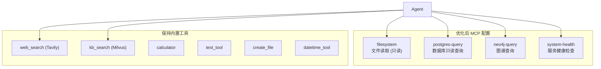

# EasyRAG MCP 服务配置优化方案

## 现状诊断

### 当前配置 ([mcp_servers.json](file:///e:/Project/EasyRAG/config/mcp_servers.json))

| 服务 | 传输 | 状态 | 问题 |
|------|------|------|------|
| `demo` | stdio | ✅ 启用 | ❌ 纯测试用，生产无意义，`allowed_tools: ["*"]` 权限过宽 |
| `filesystem` | stdio | ✅ 启用 | ⚠️ 路径在本地/Docker 间不一致，工具白名单合理但缺少 `write_file` 的显式管控 |

### 核心问题

```mermaid
flowchart LR
    subgraph 已有基础设施
        PG["PostgreSQL"]
        Redis["Redis"]
        Neo4j["Neo4j"]
        Milvus["Milvus"]
        RustFS["RustFS / S3"]
        Tavily["Tavily API"]
        MinerU["MinerU"]
        Ollama["Ollama"]
    end

    subgraph MCP 层
        demo["demo ❌"]
        fs["filesystem ✅"]
    end

    Agent --> MCP 层
    MCP 层 -.->|"缺失"| PG
    MCP 层 -.->|"缺失"| Neo4j
    MCP 层 -.->|"缺失"| Tavily
    fs --> RustFS
```

1. **demo 服务占用资源无业务价值** — 每次启动额外开一个子进程 + 事件循环线程，仅提供 echo/get_time
2. **无数据库查询 MCP** — Postgres (含 pgvector) 和 Neo4j 已在运行但 Agent 无法直接查询
3. **Docker 配置不一致** — `mcp_servers.docker.json` 缺少 `capabilities` 字段，路径不同但无环境变量控制
4. **Sandbox 与 MCP 脱节** — `sandbox_policy.json` 仅覆盖 `web_search` 和 `create_file`，未覆盖 MCP 桥接工具
5. **缺少健康检查** — MCP server 挂掉后 Agent 只在调用时才发现

---

## 优化方案

### 方案总览



> [!IMPORTANT]
> 核心原则：MCP 用于**扩展 Agent 的外部工具能力**，而非替代已有的内置工具（`web_search`、`kb_search` 等已通过 ToolRegistry 直接注册，无需 MCP 二次包装）。

---

### 1️⃣ 移除 demo 服务

**变更**：将 `demo` 的 `enabled` 设为 `false`（保留代码，不删除，方便调试）

**理由**：
- 每次应用启动白白多一个子进程 + 线程
- `allowed_tools: ["*"]` 在 audit 模式下不会被拦截，但违反最小权限
- echo / get_time 无任何业务场景

---

### 2️⃣ 优化 filesystem 服务

**变更**：
- 统一使用环境变量控制路径，消除本地/Docker 配置分裂
- 添加 `capabilities` 标签用于 sandbox 审计
- 精简为纯只读（移除 `search_files`，该工具在大目录下可能卡住）

```json
{
  "name": "filesystem",
  "transport": "stdio",
  "enabled": true,
  "command": ["npx", "-y", "@modelcontextprotocol/server-filesystem", "${MCP_FS_ROOT:-./volumes}"],
  "capabilities": ["fs.read"],
  "allowed_tools": [
    "read_file",
    "list_directory",
    "directory_tree",
    "get_file_info"
  ]
}
```

> [!NOTE]
> 当前 Manager 不支持命令中的环境变量插值，需在 `config.py` 的 `load_mcp_servers` 中增加 `os.path.expandvars()` 处理。下面第 5 节给出代码变更。

---

### 3️⃣ 新增 postgres-query 服务

**价值**：Agent 可直接执行只读 SQL 查询知识库元数据、用户信息、对话历史统计等。

```json
{
  "name": "postgres-query",
  "transport": "stdio",
  "enabled": true,
  "command": [
    "npx", "-y", "@modelcontextprotocol/server-postgres",
    "postgresql://${POSTGRES_USER:-easyrag}:${POSTGRES_PASSWORD:-easyrag_secret}@${POSTGRES_HOST:-localhost}:${POSTGRES_PORT:-5432}/${POSTGRES_DB:-easyrag}"
  ],
  "capabilities": ["db.read"],
  "allowed_tools": ["query"]
}
```

> [!WARNING]
> 该 MCP server 会直接连接数据库。必须确保：
> - 使用**只读**数据库用户（或在 Postgres 端配置 `DEFAULT_TRANSACTION_READ_ONLY = on`）
> - `allowed_tools` 仅开放 `query`，不开放 `execute`

---

### 4️⃣ 新增 system-health 自建 MCP 服务

**价值**：Agent 遇到检索/存储错误时可主动诊断哪个组件挂了，而不是对用户说"服务异常"。

类似 demo_server 的自建服务，实现以下工具：

| 工具名 | 功能 |
|--------|------|
| `check_postgres` | 尝试连接并返回连接池状态 |
| `check_redis` | PING 测试 + 内存用量 |
| `check_milvus` | 集合列表 + 行数统计 |
| `check_neo4j` | 节点/关系数量概览 |

```json
{
  "name": "system-health",
  "transport": "stdio",
  "enabled": true,
  "command": ["python", "-m", "app.tools.mcp.health_server"],
  "capabilities": ["ops.monitor"],
  "allowed_tools": ["check_postgres", "check_redis", "check_milvus", "check_neo4j"]
}
```

> [!TIP]
> 此服务应仅在 DEBUG=true 或 AGENT_MODE=deepagents 时自动启用，避免对简单对话场景增加不必要的开销。

---

### 5️⃣ 合并本地/Docker 配置为单文件

**当前问题**：维护两个 JSON 文件，字段不一致容易出 bug。

**方案**：保留单个 `mcp_servers.json`，使用环境变量插值解决路径差异。在 [config.py](file:///e:/Project/EasyRAG/app/tools/mcp/config.py) 中加一行：

```python
# load_mcp_servers() 中，读取 raw 后：
import os
raw = os.path.expandvars(raw)   # 支持 ${VAR:-default} 风格插值
```

然后在 Docker Compose 的 `environment` 中设置：
```yaml
MCP_FS_ROOT: /app/volumes
```

即可用同一份配置覆盖两种环境，删掉 `mcp_servers.docker.json`。

> [!CAUTION]
> `os.path.expandvars` 在 Windows 上仅支持 `%VAR%` 和 `$VAR` 语法，不支持 `${VAR:-default}`。需要自己实现或用 `re.sub` 处理 `${VAR:-default}` 模式。下面给出实现。

---

### 6️⃣ Sandbox 策略补全

当前 [sandbox_policy.json](file:///e:/Project/EasyRAG/config/sandbox_policy.json) 未覆盖 MCP 工具。MCP 工具注册时名称为 `mcp_<server>_<tool>`，需增加规则：

```json
{
  "defaults": {
    "mode": "audit",
    "deny_capabilities": ["proc.exec"]
  },
  "rules": [
    { "tool": "web_search", "allow": true },
    { "tool": "create_file", "allow": true },
    { "tool": "mcp_filesystem_*", "allow": true, "comment": "文件只读操作" },
    { "tool": "mcp_postgres-query_query", "allow": true, "comment": "数据库只读查询" },
    { "tool": "mcp_system-health_*", "allow": true, "comment": "健康检查" }
  ]
}
```

---

## 优化后完整配置预览

```json
{
  "servers": [
    {
      "name": "demo",
      "transport": "stdio",
      "enabled": false,
      "command": ["python", "-m", "app.tools.mcp.demo_server"],
      "capabilities": ["none"],
      "allowed_tools": ["echo", "get_time"]
    },
    {
      "name": "filesystem",
      "transport": "stdio",
      "enabled": true,
      "command": ["npx", "-y", "@modelcontextprotocol/server-filesystem", "${MCP_FS_ROOT:-./volumes}"],
      "capabilities": ["fs.read"],
      "allowed_tools": [
        "read_file",
        "list_directory",
        "directory_tree",
        "get_file_info"
      ]
    },
    {
      "name": "postgres-query",
      "transport": "stdio",
      "enabled": true,
      "command": [
        "npx", "-y", "@modelcontextprotocol/server-postgres",
        "postgresql://${POSTGRES_USER:-easyrag}:${POSTGRES_PASSWORD:-easyrag_secret}@${POSTGRES_HOST:-localhost}:${POSTGRES_PORT:-5432}/${POSTGRES_DB:-easyrag}"
      ],
      "capabilities": ["db.read"],
      "allowed_tools": ["query"]
    },
    {
      "name": "system-health",
      "transport": "stdio",
      "enabled": false,
      "command": ["python", "-m", "app.tools.mcp.health_server"],
      "capabilities": ["ops.monitor"],
      "allowed_tools": ["check_postgres", "check_redis", "check_milvus", "check_neo4j"],
      "_comment": "手动启用或在 DeepAgents 模式下自动启用"
    }
  ]
}
```

---

## 需要的代码变更

| 文件 | 变更 | 优先级 |
|------|------|--------|
| [config/mcp_servers.json](file:///e:/Project/EasyRAG/config/mcp_servers.json) | 替换为优化后配置 | 🔴 高 |
| [config/mcp_servers.docker.json](file:///e:/Project/EasyRAG/config/mcp_servers.docker.json) | 删除（合并到主配置） | 🔴 高 |
| [app/tools/mcp/config.py](file:///e:/Project/EasyRAG/app/tools/mcp/config.py) | 增加环境变量插值支持 | 🔴 高 |
| [config/sandbox_policy.json](file:///e:/Project/EasyRAG/config/sandbox_policy.json) | 补全 MCP 工具规则 | 🟡 中 |
| `app/tools/mcp/health_server.py` | 新建健康检查 MCP server | 🟢 低（可后续增加）|
| [docker-compose.yml](file:///e:/Project/EasyRAG/docker-compose.yml) | backend environment 增加 `MCP_FS_ROOT` | 🟡 中 |

---

## 不建议做的事

| ❌ 不做 | 原因 |
|---------|------|
| 用 MCP 包装 Tavily/web_search | 已有原生 `web_search_tool.py`，MCP 包装增加延迟、多一层故障点 |
| 用 MCP 包装 kb_search | Milvus 检索已深度集成到 RAG pipeline，MCP 包装会丢失上下文窗口管理 |
| 为每个 Skill 创建独立 MCP server | Skill 是 prompt 层面的组织，tool_dependencies 已通过 ToolRegistry 解决 |
| 暴露 Neo4j Cypher 给 Agent | 读写风险高，优先用 `kb_search` 的图增强检索路径；仅在 system-health 中做只读状态查询 |
